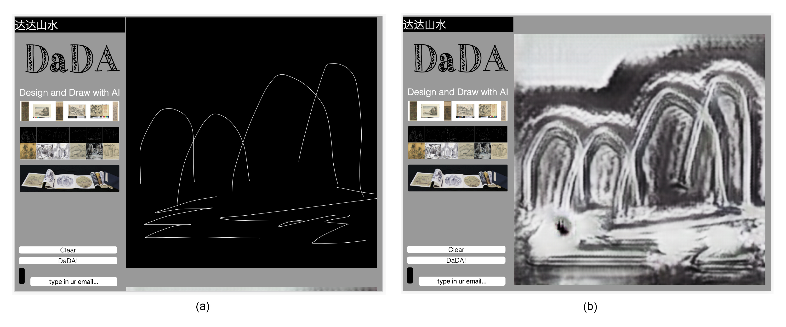
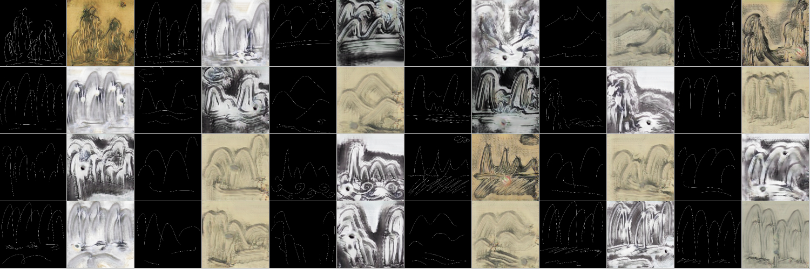
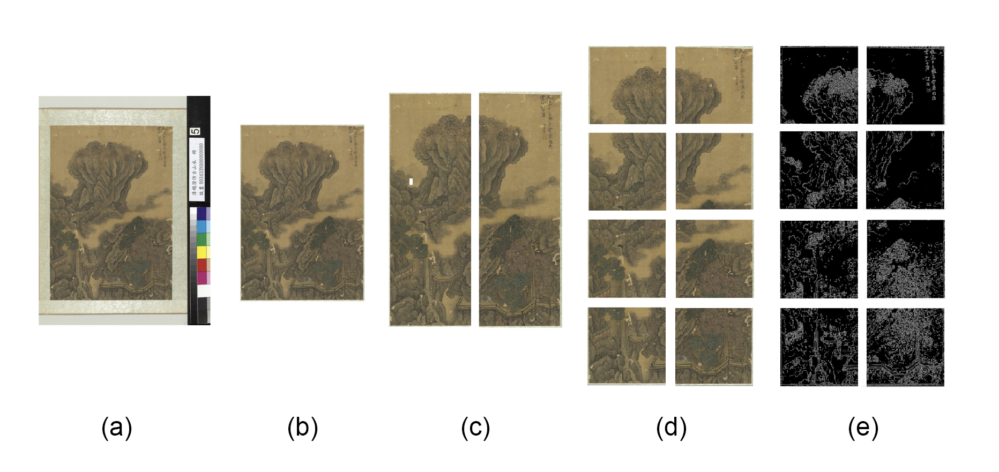
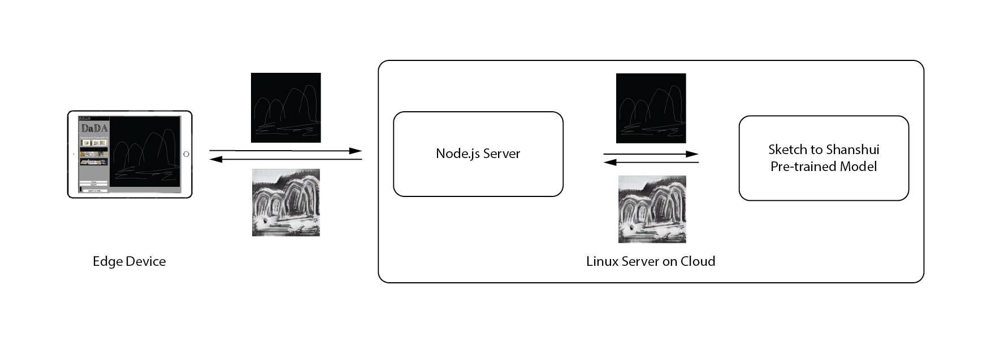

# ShanshuiDaDA(Powered by INTEL openVINO)

[2' Video on the Whole Story of ShanshuiDaDA.](https://vimeo.com/305236841)

## Background
"ShanshuiDaDA" is an interactive installation powered by machine learning model - **CycleGAN** and trained with custom data. At the very beginning, ShanshuiDaDA was trained with [cycleGAN official pytorch implementation](https://github.com/junyanz/pytorch-CycleGAN-and-pix2pix) on custom [sketch2shanshui](https://github.com/aaaven/sketch2shanshui) data set. In this project, we port it to [openVINO](https://software.intel.com/en-us/openvino-toolkit) as an experiment and run for [🆒AI on PC Early Innovation!](https://www.intel.ai/).


* ShanshuiDaDA Running on Surface Pro 6 (Powered by INTEL 8th Gen CPU).

 

* Interface Design: Participant Scribbled Sketch (a) & ShanshuiDaDA Generated Shanshui (b). 



* Sketch and Shanshui Pairs Co-created by Participants and ShanshuiDaDA.

## Idea and Artistic Statement of ShanshuiDaDA
**Shanshui-DaDA (2018)**

“Shanshui–DaDA” is an interactive installation that utilizes a machine-learning algorithm in helping amateur participants realize traditional style Chinese Ink Wash Paintings. The audience is invited to sketch a simple line drawing representation of their ideal landscape painting in the software interface, through calculation, “Shanshui-DaDA” will generate a Chinese “Shanshui” based on the input drawn by the user. “Shanshui-DaDA” is the first of a series of explorations-“DaDA: Design and Draw with AI”- that seek to find AI’s role in traditionally human creativity centered areas. By way of challenging the creator’s conventional position, the artist poses the questions: Can we collaborate with AI to better facilitate, even enhance human creativity?

## Technical Details

"Shanshui-DaDA" is trained with "CycleGAN" [(offical pytorch implementation)](https://github.com/junyanz/pytorch-CycleGAN-and-pix2pix) on 108 (later got expanded to 205 paintings) Shanshui paintings collected from online open data. The raw painting scans are pre-processed to 1772 pairs of edge-painting (sketches) and Shanshui paintings[(More on the data set)](https://github.com/aaaven/sketch2shanshui). 



* Data Preprocessing: From Scans to Sketch2Shanshui Data Set.

And the trained Pytorch model got ported to [openVINO](https://software.intel.com/en-us/openvino-toolkit) [(More on how to port pytorch model to openVINO)](https://github.com/aaaven/sketch2shanshui) and further wrapped with a nodejs based client-server system. User will sketch on the web interface and click to summit the sketch to backend node server and inference with openVINO.



* How the Interactive System Works.

A more detailed documentation including everything about how the project is developed from concept to implementation is [here] (https://www.aven.cc/Shanshui-DaDA.html)! Like how to preprocess the collected paintings, training setup and process are all included.

## Technical Difficulties

<!-- We are still struggling on how to reproduce similar result/performance of the original [shanshuiDaDA based on pytorch](https://github.com/aaaven/ShanshuiDaDA_pth). We did NOT get a satisfying result with TF implementation yet, but we are still working on it and seeking for solutions and any advice are much appreciated!

## Instructions on How to Run ShanshuiDaDA

Here are details on how to train sketch2shanshui translation on sketch2shanshui data set. In this repo, we provide both TF 2.0 and TF 1.7 implementations, TF 2.0 is located in **./sketch2shanshui** directory while TF 1.7 is located in **./_sketch2shanshui** directory.

#### To Train the Sketch2Shanshui

As mentioned earlier, we have included both TF 2.0 and TF 1.7 implementations, the process for both implementations are almost the same.

- 1. Clone this project and change directory to _sketch2shanshui (or sketch2shanshui)

        ``` bash
        git clone
        cd shanshuiDaDA_tf2.0/_sketch2shanshui (or cd shanshuiDaDA_tf2.0/sketch2shanshui)
        ```

- 2. Install anaconda. In case you don't have it, here is the [official instruction](https://www.anaconda.com/download/) 


- 3. Create conda environment from the **environment.yml** file. This will automatically install all necessary dependencies, so it might take a while depends on your setup.

        ``` bash
        conda env create -f environment.yml
        ```

- 4. After the environment is ready, you can activate the env for this project with:

        ``` bash
        conda activate shanshuiDaDA_tf17 (or shanshuiDaDA_tf20)
        ```

- 5. Download sketch2shanshui Dataset and start training. We had included the link to the data set in README.md file located in datasets folder, the sketch2shanshui folder should go to **datasets/sketch2shanshui**

- 6. Train the sketch2shanshui translation with:

        ``` bash
        bash train_shanshuiDaDA.sh
        ```

- 7. The checkpoint will be saved at **outputs/sketch2shanshui**. If you want to use our pre-trained model to inference ShanshuiDaDA, please refer to README.md file in the output folder. There is a link to google drive to download the checkpoint. And the checkpoint folder **sketch2shanshui** should be put into **output/sketch2shanshui**.

### To Run (Inference) ShanshuiDaDA

If you only want to run ShanshuiDaDA on your device, make sure you followed 1 - 4 steps in **To Train the Sketch2Shanshui** and downloaded our pre-trained model (refer ./sketch2shanshui/output/README.md)

- 1. Install [Node](https://nodejs.org/en/download/package-manager/)

- 2. Activate conda environment with:

        ```bash
        conda activate shanshuiDaDA_tf17 (or shanshuiDaDA_tf20)
        ```

- 3. Run app with:

        ``` bash
        node _app.js (or app.js)
        ```

- 4. Open [localhost:8000](http://localhost:8000/) in browser OR (Highly Suggested!) Use **a touch screen device preferably an iPad** to load the page through a local network, just replace "localhost" with the IP of the computer running ShanshuiDaDA. eg. **192.168.7.1:8000** assuming the IP of the computer is **192.168.7.1**.


 -->


* This code has been tested with openVINO on mac version openvino_2019.1.090, [install guide](https://docs.openvinotoolkit.org/latest/_docs_install_guides_installing_openvino_macos.html) here.

* To run this on linux, there will be serveral tweaks needed:
   * reinferece.py
      - line 35,36 need be changed to your openvino path and linux/mac are different


* Clone this project:
``` bash
git clone
```

* Install openVINO for mac. [Instruction](https://docs.openvinotoolkit.org/latest/_docs_install_guides_installing_openvino_macos.html)

* change directory to this project:
``` bash
cd shanshuiDadA_openVINO
```

* Start node.js server
``` bash
node newapp.js
```
* Open [localhost:8000](http://localhost:8000/) in your browser

* OR (Suggested!) Use **a touch screen device eg.Tablet, Smart Phone etc.** to load the url and draw SHANSHUI from there. 

* The model was trained with pytorch and converted to onnx then inference with openVINO
    * More on how ShanshuiDaDA project on [my page](https://www.aven.cc/Shanshui-DaDA.html) and [this repo](https://github.com/aaaven/ShanshuiDaDA_pth)
    * More on how to convert/inference pytorch pretrained model with openVINO can be find [here](https://github.com/aaaven/shanshuiDaDA_openVINO_modelONLY)
